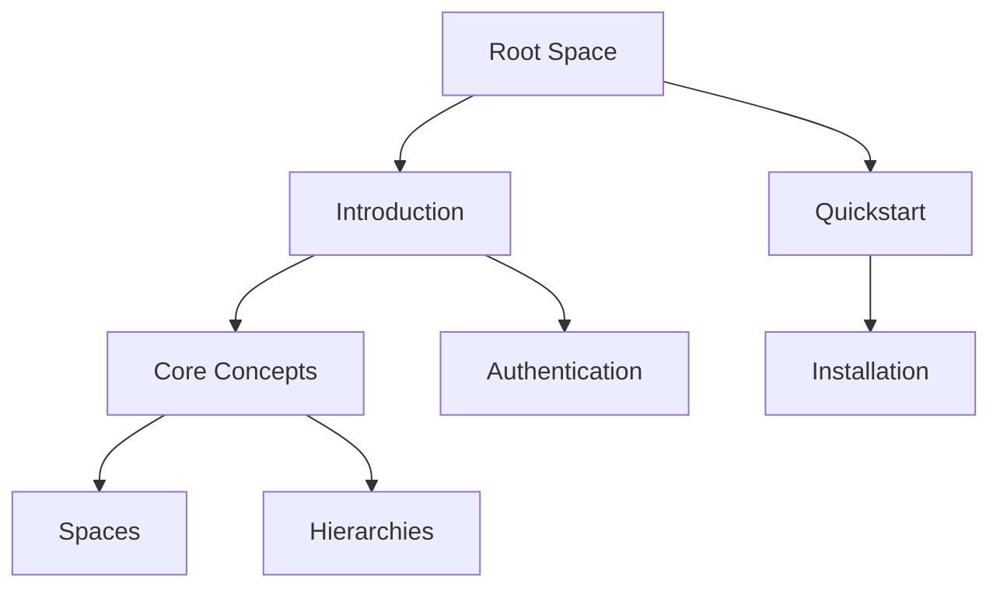

## Overview

Web Developer provides a robust platform for creating and managing documentation. You organize content into spaces, build page hierarchies, leverage rich markdown support, manage user roles, and follow a streamlined workflow. These core concepts form the foundation for efficient documentation projects.

<Callout kind="info">
  Master these concepts to scale your documentation from simple guides to comprehensive knowledge bases.
</Callout>

## Key Concepts

Explore the building blocks through these visual summaries.

<Columns cols={3}>
  <Card title="Documentation Spaces" icon="layers" href="#documentation-spaces">
    Group related docs into isolated spaces for teams or projects.
  </Card>
  <Card title="Page Hierarchies" icon="layout" href="#page-hierarchies">
    Structure pages with nested navigation for intuitive access.
  </Card>
  <Card title="Content Types" icon="file-text" href="#content-types">
    Support markdown, MDX, and interactive components.
  </Card>
  <Card title="User Roles" icon="users" href="#user-roles">
    Control access with granular permissions.
  </Card>
  <Card title="Lifecycle Workflow" icon="git-branch" href="#lifecycle-workflow">
    Manage creation, review, and publishing seamlessly.
  </Card>
</Columns>

## Documentation Spaces

Documentation spaces act as containers for your projects. Create a space for each product, team, or initiative. Each space maintains independent settings, themes, and permissions.

You start by creating a space via the dashboard at `https://dashboard.example.com/spaces/new`. Spaces support custom branding, like setting a brand color to `#3B82F6`.

<Expandable title="Advanced Space Settings" default-open="false">
  Configure analytics, custom domains, and webhooks for integrations.
</Expandable>

## Page Hierarchies and Organization

Build intuitive navigation with nested pages. Parent pages contain children, forming a tree structure. Use frontmatter for metadata and slugs for clean URLs.



Link pages with relative paths like `/concepts#page-hierarchies`.

## Content Types and Markdown Support

Web Developer supports standard markdown plus MDX for interactive components. Write rich docs with headings, lists, tables, and code blocks.

<Tabs>
  <Tab title="Markdown Example" icon="file">
    Use standard syntax for structured content.

    ```markdown
    ## Heading

    - List item
    - Another item

    | Feature | Support |
    |---------|---------|
    | Tables  | Yes    |
    | Images  | Yes    |
    ```
  </Tab>
  <Tab title="MDX Components" icon="code">
    Embed components like `<Callout>` for enhanced UX.

    <CodeGroup tabs="JavaScript,Python">
    ````javascript
    import { Callout } from './components';
    <Callout kind="tip">Pro tip here.</Callout>
    ````
    ````python
    # Render MDX in Python via markdown-it
    import markdown_it
    md = markdown_it()
    html = md.render("**Bold text**")
    ````
    </CodeGroup>
  </Tab>
</Tabs>

## User Roles and Permissions

Assign roles to control access. Roles include Viewer, Editor, Admin, and Owner.

| Role    | View | Edit | Delete | Manage Users |
|---------|------|------|--------|--------------|
| Viewer  | Yes  | No   | No     | No           |
| Editor  | Yes  | Yes  | No     | No           |
| Admin   | Yes  | Yes  | Yes    | Yes          |
| Owner   | Yes  | Yes  | Yes    | Yes          |

Set permissions at the space or page level. For example, grant Editors write access to `/docs/guides`.

<Callout kind="alert">
  Regularly review permissions to maintain security.
</Callout>

## Documentation Lifecycle Workflow

Follow this structured process to manage your docs effectively.

<Steps>
  <Step title="Plan" icon="calendar">
    Outline topics and assign owners.
  </Step>
  <Step title="Draft" icon="edit-3">
    Create pages using markdown and MDX.
  </Step>
  <Step title="Review" icon="eye">
    Use comments and previews for feedback.
  </Step>
  <Step title="Publish" icon="upload">
    Deploy changes to production.
  </Step>
  <Step title="Maintain" icon="settings">
    Monitor analytics and update as needed.
  </Step>
</Steps>

<Columns cols={2}>
  <Card title="Next: Quickstart" icon="zap" href="/quickstart">
    Set up your first space in minutes.
  </Card>
  <Card title="API Reference" icon="api" href="/authentication">
    Integrate programmatically.
  </Card>
</Columns>