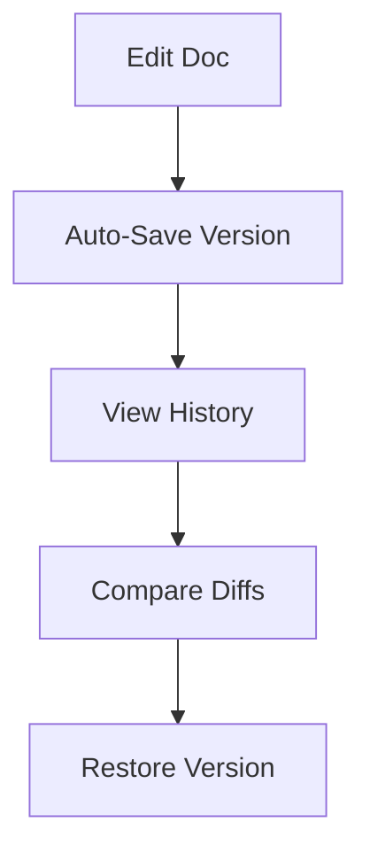

## Overview

Web Developer empowers you to manage project documentation with advanced tools for organization, collaboration, and publishing. Organize content hierarchically, collaborate in real-time, track changes with version history, search efficiently, and export seamlessly. These features streamline your workflow from creation to sharing.

<Callout kind="info">
  Start by creating a new space in your dashboard at `https://dashboard.example.com` to explore these capabilities.
</Callout>

## Feature Overview

Discover the core capabilities at a glance.

<Columns cols={3}>
  <Card title="Advanced Organization" icon="folder" href="#advanced-organization">
    Structure docs with folders, tags, and custom hierarchies.
  </Card>
  <Card title="Real-time Collaboration" icon="users" href="#collaboration">
    Edit docs simultaneously with team members.
  </Card>
  <Card title="Version Control" icon="git-branch" href="#version-control">
    Track changes and revert with full history.
  </Card>
  <Card title="Search & Analytics" icon="search" href="#search">
    Find content quickly and gain usage insights.
  </Card>
  <Card title="Export Options" icon="download" href="#export">
    Publish to PDF, HTML, or embed anywhere.
  </Card>
</Columns>

## Advanced Organization Tools

Organize your documentation using nested folders, tags, and custom metadata. Create unlimited hierarchies to match your project structure.

<Tabs>
  <Tab title="Create Folder" icon="folder-plus">
    Use the dashboard to add folders.

    <Steps>
      <Step title="Navigate" icon="navigation">
        Go to your space overview.
      </Step>
      <Step title="Add Folder" icon="plus">
        Click <kbd>New</kbd> > <kbd>Folder</kbd>.
      </Step>
      <Step title="Tag" icon="tag">
        Assign tags like `api`, `guide`.
      </Step>
    </Steps>
  </Tab>
  <Tab title="API Example" icon="code">
    Programmatically manage structure via API.

````jsx
<CodeGroup tabs="JavaScript,Python">
```javascript
const response = await fetch('https://api.example.com/v1/folders', {
  method: 'POST',
  headers: { 'Authorization': 'Bearer YOUR_TOKEN' },
  body: JSON.stringify({ name: 'API Docs', parentId: 'root' })
});
```

```python
import requests
response = requests.post(
  'https://api.example.com/v1/folders',
  headers={'Authorization': 'Bearer YOUR_TOKEN'},
  json={'name': 'API Docs', 'parentId': 'root'}
)
```
</CodeGroup>
````
  </Tab>
</Tabs>

## Real-time Collaboration and Editing

Invite team members to co-edit docs live. Changes appear instantly, with cursor indicators and comments.

<Callout kind="tip">
  Share spaces via `https://dashboard.example.com/share/{spaceId}` for instant access.
</Callout>

## Version Control and History

Every edit creates a version. Compare diffs, restore previous states, or branch docs like code.



## Search and Analytics Features

Search across all docs with full-text indexing. Track views, edits, and popular content via analytics dashboard.

| Feature | Description | Metrics |
|---------|-------------|---------|
| Full-Text Search | Query titles, content, tags | `<1s` response |
| Analytics | Page views, edit frequency | Real-time charts |
| Filters | By folder, tag, date | Advanced operators |

## Export and Publishing Options

Export to PDF, HTML, Markdown, or generate embeds. Publish directly to your site or share via links.

<Expandable title="Advanced Export Config" default-open="false">

Configure exports with custom themes.

````javascript
// Export API call
const exportDoc = await fetch('https://api.example.com/v1/export', {
  method: 'POST',
  body: JSON.stringify({
    docId: 'doc-123',
    format: 'pdf',
    theme: 'custom-blue'  // Matches brand #3B82F6
  })
});
````

</Expandable>